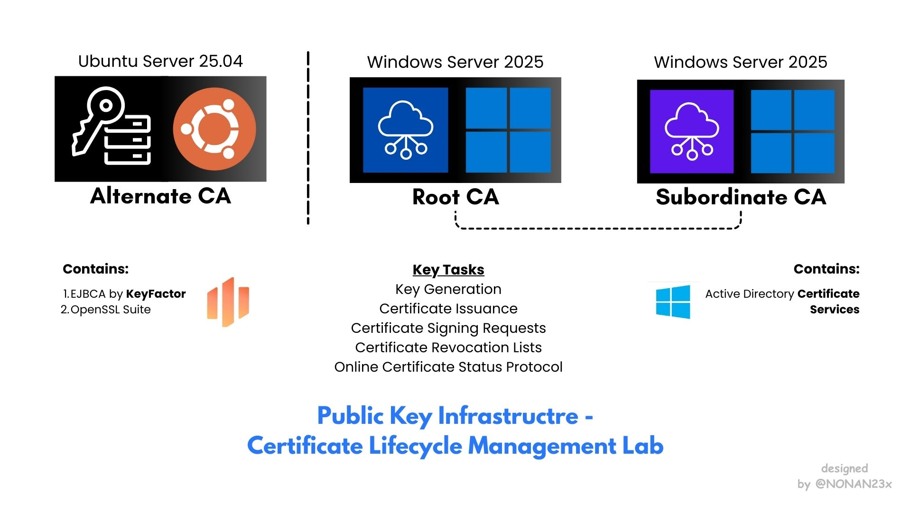

# Public Key Infrastructure Lab
This repository documents my journey through building a comprehensive Public Key Infrastructure (PKI) home lab. The lab explores various aspects of PKI implementation, from traditional Microsoft Active Directory Certificate Services to open-source solutions like EJBCA, and includes hands-on experience with cryptographic tools and hardware security modules

## Disclaimer

This lab is intended for educational and research purposes only. Ensure compliance with applicable laws and regulations when implementing PKI in production environments

## Lab Components

### 1. Microsoft Active Directory PKI Environment
- **Infrastructure**: Deployed 2 Domain Controllers and 2 Domain Joined Workstations
- **Certificate Authority Setup**:
  - Root Certificate Authority (CA)
  - Subordinate Certificate Authority
- **Certificate Issuance**: Microsoft IIS Server Client TLS Certificate via AD Certificate Services

### 2. Linux CA
- **OpenSSL Environment**: Ubuntu VM for cryptographic exploration
  - RSA and ECDSA key pair generation
  - Digital certificate and CSR creation
  - CRL and OCSP implementation
- **EJBCA Docker Deployment**: Root and Subordinate CA configuration
  - Client and Server TLS certificate issuance
  - Crypto token creation and management

## Objectives

This writeup serves as a practical learning platform for:
- Understanding PKI fundamentals and architecture
- Implementing certificate authorities and hierarchies
- Hands-on experience with certificate lifecycle management
- Exploring various PKI tools and technologies
- Comparing traditional vs. modern PKI solutions

## Getting Started

Please refer to the documentation files for detailed setup and implementation guides:
- **Windows PKI Setup**: See [PKI on Windows](./PKI%20on%20Windows%20using%20ADCS.md) for Microsoft Active Directory Certificate Services configuration
- **Linux PKI Setup**: See [PKI on Linux](./PKI%20on%20Linux%20using%20EJBCA.md) for OpenSSL and EJBCA deployment instructions

## Future Enhancements

- Integration with cloud-based PKI services
- Automation of certificate deployment processes
- Implementation of certificate transparency
- Exploration of post-quantum cryptography
- Advanced HSM integration scenarios

## Contributing

This is a personal learning project, but feel free to:
- Open issues for questions or suggestions
- Fork and adapt for your own PKI learning journey
- Share your own PKI lab experiences

## License

This project is for educational purposes. Please refer to individual tool licenses for any code or configurations included
